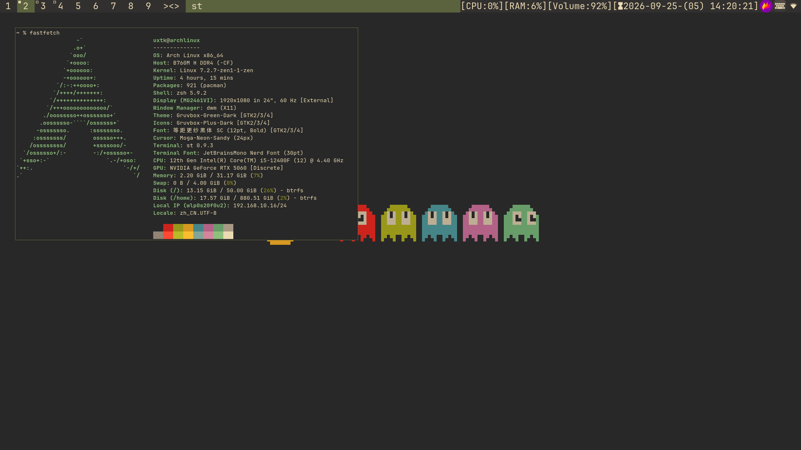

# dwm
# appinstall脚本只针对基本系统，如果已经不是基本系统请不要运行!
dwm配置分享

使用字体：

JetBrainsMono Nerd Font

Sarasa Mono SC

添加的补丁：

dwm补丁

dwm-pertag

dwm-scratchpad

dwm-alwayscenter

dwm-attachaside

dwm-actualfullscreen

dwm-resizecorners

dwm-restartsig

dwm-gridmode

dwm-systray

dmenu补丁

dmenu-caseinsensitive

dmenu-fuzzymatch

dmenu-numbers

st基于https://github.com/gnuunixchad/st

添加的快捷键：

mod+` : 创建临时终端

mod+shift+f ： 真正全屏

mod+ctrl+q : 刷新配置

mod+n : 打开网络管理器(nmtui)

mod+g : 切换网格布局
